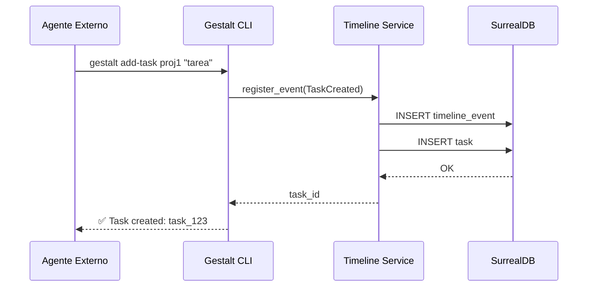

# 🏗️ Architecture

## Stack
- **Language:** Rust (Edition 2021)
- **Framework:**
  - `gestalt_core`: Generic Logic (No IO)
  - `gestalt_timeline`: Tokio + SurrealDB (Orchestration)
  - `gestalt_cli`: Clap + Rustyline (Interface)
- **Database:** SurrealDB (Embedded / WebSocket)
- **Messaging:** Git-Core Protocol v3.5.0 (JSON over Stdio/HTTP)

## Key Decisions

### 1. Asynchronous Autonomy
**Decision:** All long-running agent actions must be non-blocking.
**Rationale:** The agent cannot "Think" if it is waiting for `cargo build`.
**Implementation:**
- `AgentRuntime` spawns `tokio::task` for `StartJob` / `ExecuteShell`.
- Returns `JobId` immediately.
- Agent explicitly polls or awaits via `AwaitJob`.

### 2. Protocol-First Tooling
**Decision:** Tools are effectively just other Agents.
**Rationale:** To avoid hardcoding every tool (gh, aws, docker), we treat them as "specialized agents" invoked via CLI.
**Implementation:** `CallAgent { tool: "gh", args: [...] }`.

### 3. Context Injection
**Decision:** Context is gathered *before* the prompt is built, never during.
**Rationale:** LLMs need the full picture immediately.
**Implementation:** `ContextEngine` scans `.gitcore` and source map.

### 4. Planning Artifacts Location (Protocol Hygiene)
**Decision:** Planning trackers are kept under `.gitcore/planning/` as source of truth.
**Rationale:** Avoid protocol drift and duplicated planning state.
**Implementation:**
- `PLANNING.md` moved to `.gitcore/planning/PLANNING.md`.
- `TASK.md` moved to `.gitcore/planning/TASK.md`.
- Any legacy planning docs outside `.gitcore/planning/` are historical references only and must not be used as active tracker.

## Component Diagram
```mermaid
graph TD
    CLI[gestalt_cli] -->|Command| Runtime[AgentRuntime]
    Runtime -->|Prompt| LLM[Bedrock/Gemini/Ollama]
    Runtime -->|Action| Tools
    Runtime -->|Async| Jobs[JobManager]
    Tools -->|Git-Core| ExtAgents[External Agents (gh, aws)]
    Jobs -->|Status| Runtime
```

## 🕐 Timeline Design

### Concept Central
El **timestamp** es la variable primaria de todo el sistema. Cada acción, comando, resultado o cambio de estado se registra en una línea de tiempo universal accesible por todos los agentes.

### Modelo de Datos: TimelineEvent

```rust
pub struct TimelineEvent {
    pub id: String,              // Unique ID (ULID preferido)
    pub timestamp: DateTime<Utc>, // ⭐ Variable primaria
    pub agent_id: String,         // Qué agente ejecutó la acción
    pub event_type: EventType,    // Tipo de evento
    pub project_id: Option<String>,
    pub task_id: Option<String>,
    pub payload: serde_json::Value,
    pub metadata: HashMap<String, String>,
}

pub enum EventType {
    ProjectCreated,
    ProjectUpdated,
    TaskCreated,
    TaskStarted,
    TaskCompleted,
    TaskFailed,
    AgentConnected,
    AgentDisconnected,
    CommandExecuted,
    Custom(String),
}
```

## 🖥️ Especificación CLI

### Comandos Base

| Comando | Descripción | Ejemplo |
|---------|-------------|---------|
| `add-project <nombre>` | Registra nuevo proyecto | `gestalt add-project my-app` |
| `add-task <proyecto> <desc>` | Añade subtarea | `gestalt add-task my-app "Fix bugs"` |
| `run-task <task_id>` | Ejecuta tarea (async) | `gestalt run-task task_123` |
| `list-projects` | Lista proyectos | `gestalt list-projects` |
| `list-tasks [proyecto]` | Lista tareas | `gestalt list-tasks my-app` |
| `status <proyecto>` | Muestra progreso | `gestalt status my-app` |
| `timeline [--since=1h]` | Muestra línea de tiempo | `gestalt timeline --since=2h` |

## 🔄 Flujo de Ejecución


