# 🏗️ Architecture

## Stack
- **Language:** Rust (Edition 2021)
- **Framework:**
  - `gestalt_core`: Generic Logic (No IO)
  - `gestalt_timeline`: Tokio + SurrealDB (Orchestration)
  - `gestalt_cli`: Clap + Rustyline (Interface)
- **Database:** SurrealDB (Embedded / WebSocket)
- **Messaging:** Git-Core Protocol v3.5.0 (JSON over Stdio/HTTP)

## Key Decisions

### 1. Asynchronous Autonomy
**Decision:** All long-running agent actions must be non-blocking.
**Rationale:** The agent cannot "Think" if it is waiting for `cargo build`.
**Implementation:**
- `AgentRuntime` spawns `tokio::task` for `StartJob` / `ExecuteShell`.
- Returns `JobId` immediately.
- Agent explicitly polls or awaits via `AwaitJob`.

### 2. Protocol-First Tooling
**Decision:** Tools are effectively just other Agents.
**Rationale:** To avoid hardcoding every tool (gh, aws, docker), we treat them as "specialized agents" invoked via CLI.
**Implementation:** `CallAgent { tool: "gh", args: [...] }`.

### 3. Context Injection
**Decision:** Context is gathered *before* the prompt is built, never during.
**Rationale:** LLMs need the full picture immediately.
**Implementation:** `ContextEngine` scans `.gitcore` and source map.

### 4. Planning Artifacts Location (Protocol Hygiene)
**Decision:** Planning trackers are kept under `.gitcore/planning/` as source of truth.
**Rationale:** Avoid protocol drift and duplicated planning state.
**Implementation:**
- `PLANNING.md` moved to `.gitcore/planning/PLANNING.md`.
- `TASK.md` moved to `.gitcore/planning/TASK.md`.
- Any legacy planning docs outside `.gitcore/planning/` are historical references only and must not be used as an active tracker.

### 5. Virtual File System (VFS) Overlay
**Decision:** Agents operate in a volatile memory-mapped workspace before persistent commit.
**Rationale:** Multiple agents can edit the same codebase simultaneously without Git branch conflicts or corrupting the main disk.
**Implementation:** `VirtualFs` adapter wraps `tokio::fs`, providing read-through and write-in-memory capabilities. Implementation: `OverlayFs`.

### 6. Elastic Autonomous Loops (Resilience)
**Decision:** Remove fixed step limits in favor of context compaction and dynamic delegation.
**Rationale:** Complex tasks require n-depth reasoning that exceeds static loop counters.
**Implementation:**
- **Context Compaction**: Automated summarization of older reasoning steps using `tiktoken-rs` for estimation and LLM-based summary.
- **Dynamic Delegation**: Large goals are automatically split into sub-agent tasks.

### 7. Synapse-Agentic Integration (Hive Model)
**Decision:** Adopt the "Hive" actor model for agent lifecycle management.
**Rationale:** Standardizes resiliency, supervision (auto-restart on panic), and failover strategies.
**Implementation:** `AgentRuntime` leverages `synapse_agentic::framework::Hive` for agent supervision and inter-agent communication.

## Component Diagram


## 🕐 Timeline Design

### Central Concept
The **timestamp** is the primary variable of the entire system. Every action, command, result, or state change is recorded in a universal timeline accessible by all agents.

### Data Model: TimelineEvent

```rust
pub struct TimelineEvent {
    pub id: String,              // Unique ID (ULID preferred)
    pub timestamp: DateTime<Utc>, // ⭐ Primary variable
    pub agent_id: String,         // Which agent executed the action
    pub event_type: EventType,    // Event type
    pub project_id: Option<String>,
    pub task_id: Option<String>,
    pub payload: serde_json::Value,
    pub metadata: HashMap<String, String>,
}

pub enum EventType {
    ProjectCreated,
    ProjectUpdated,
    TaskCreated,
    TaskStarted,
    TaskCompleted,
    TaskFailed,
    AgentConnected,
    AgentDisconnected,
    CommandExecuted,
    Custom(String),
}
```

## 🖥️ CLI Specification

### Base Commands

| Command | Description | Example |
|---------|-------------|---------|
| `add-project <name>` | Registers a new project | `gestalt add-project my-app` |
| `add-task <project> <desc>` | Adds a subtask | `gestalt add-task my-app "Fix bugs"` |
| `run-task <task_id>` | Executes a task (async) | `gestalt run-task task_123` |
| `list-projects` | Lists projects | `gestalt list-projects` |
| `list-tasks [project]` | Lists tasks | `gestalt list-tasks my-app` |
| `status <project>` | Shows progress | `gestalt status my-app` |
| `timeline [--since=1h]` | Shows timeline | `gestalt timeline --since=2h` |

## 🔄 Execution Flow

```mermaid
sequenceDiagram
    participant Agent as External Agent
    participant CLI as Gestalt CLI
    participant TL as Timeline Service
    participant DB as SurrealDB

    Agent->>CLI: gestalt add-task proj1 "task"
    CLI->>TL: register_event(TaskCreated)
    TL->>DB: INSERT timeline_event
    TL->>DB: INSERT task
    DB-->>TL: OK
    TL-->>CLI: task_id
    CLI-->>Agent: ✅ Task created: task_123
```


