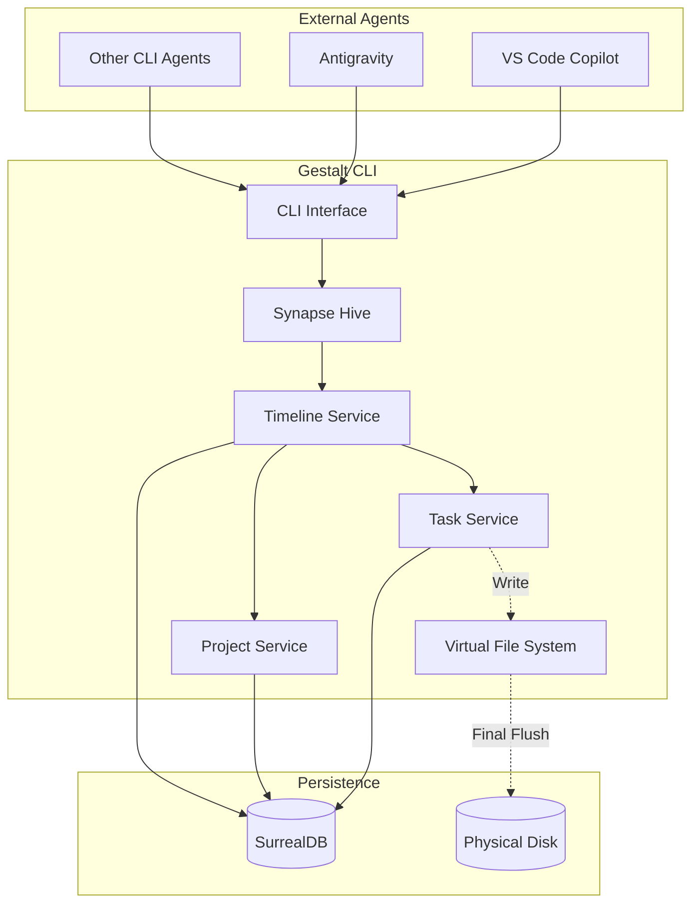

# 🧠 PLANNING.md - Gestalt Timeline Orchestrator

> **CLI Orchestrator Meta-Agent with Universal Timeline**

_Last update: 2026-02-22_

---

## 📋 Project Summary

**Gestalt Timeline** is a CLI system designed so that multiple AI agents (such as VS Code Copilot, Antigravity, or any external system) can coordinate projects and subtasks in parallel, using a **universal timeline** as the central axis of all operations.

### 🎯 Main Objective
Create a functional system that allows various agents to coordinate projects and subtasks in parallel, showing results in CLI and persisting state in SurrealDB with **timestamp as the primary variable** in all operations.

---

## 🏗️ System Architecture



### Main Components

| Component | Description |
|------------|-------------|
| **Timeline Service** | System core. Records every action with UTC timestamp. All agents access this timeline in real-time. |
| **Task Service** | Manages subtasks, asynchronous execution, and results. |
| **Project Service** | Manages projects, states, and priorities. |
| **CLI Interface** | Exposes commands for external agents. |
| **SurrealDB** | Persistence for memory, state, and timeline. |
| **Virtual File System (VFS)** | Isolation layer for agent file operations. |
| **Synapse Hive** | Agent supervisor and resilience framework. |

---

## 🛠️ Technological Stack

| Category | Technology | Justification |
|-----------|------------|---------------|
| **Language** | Rust | Safety, performance, native concurrency |
| **Async Runtime** | `tokio` | High-performance concurrency |
| **Database** | SurrealDB | Multi-model NoSQL, real-time, graph queries |
| **CLI Framework** | `clap` | Declarative and robust CLI |
| **Serialization** | `serde` | Native JSON/CBOR for SurrealDB |
| **Logging** | `tracing` | Structured observability |
| **Framework** | `synapse-agentic` | Actor model, Hive, Memory, Resilience |

---

## 📦 Project Structure

```
gestalt-rust/
├── gestalt_timeline/           # Orchestrator crate
│   ├── Cargo.toml
│   └── src/
│       ├── main.rs             # CLI Entry point
│       ├── lib.rs              # Core exports
│       ├── cli/
│       │   ├── mod.rs
│       │   └── commands.rs     # Command definitions
│       ├── services/
│       │   ├── mod.rs
│       │   ├── timeline.rs     # Timeline Service (core)
│       │   ├── project.rs      # Project Service
│       │   ├── task.rs         # Task Service
│       │   ├── vfs.rs          # Virtual File System (Isolation)
│       │   ├── context_compaction.rs # Context Compactor
│       │   └── reviewer_merge_agent.rs # Merge Approval Agent
│       ├── models/
│       │   ├── mod.rs
│       │   ├── timeline_event.rs
│       │   ├── project.rs
│       │   └── task.rs
│       └── db/
│           ├── mod.rs
│           └── surreal.rs      # SurrealDB client
├── gestalt_core/               # Shared logic
├── .gitcore/                   # Git-Core Protocol (Source of Truth)
│   ├── ARCHITECTURE.md
│   └── planning/
│       ├── PLANNING.md
│       └── TASK.md
├── docs/
│   └── agent-docs/             # Strategic agent documentation
├── CHANGELOG.md
├── README.md
└── .gitignore
```

---

## 🕐 Timeline Design

### Central Concept
The **timestamp** is the primary variable of the entire system. Every action, command, result, or state change is recorded in a universal timeline accessible by all agents.

---

## 🚀 Phase 6: Advanced Resilience and Isolation (Shadow Workspace)

**Objective:** Evolve Gestalt from a CLI tool to a swarm of local autonomous agents with total isolation.

### 1. Virtual File System (VFS) Overlay
Implemented a file system adapter that allows agents to read from disco but write to a volatile memory layer.
- **Read-Through**: Cache of physical files.
- **Write-In-Memory**: Changes do not touch `main` until the Supervisor approves the "Flush".
- **Zero Branching**: Avoids unnecessary Git branch pollution.

### 2. Elastic Loops & Context Compaction
Integrated logic so that agents can operate indefinitely without losing the thread.
- **Compaction**: Recursive summary of external token windows.
- **Hive Model**: Migration to the `synapse-agentic` actor model for supervision and failover.

---

## ⚙️ Technical Considerations

### Persistent Parallel Process
For the `watch` mode that does not terminate while in execution:
```rust
// Process that listens for events in real-time
#[tokio::main]
async fn run_watch_mode() {
    let mut stream = db.live::<TimelineEvent>("timeline_events").await?;
    while let Some(event) = stream.next().await {
        // Process and display event
        println!("{}: {}", event.timestamp, event.event_type);
    }
}
```

### External Agent Connection
Agents like VS Code Copilot can invoke commands directly:
```bash
# From any terminal or script
gestalt add-task "my-project" "Implement feature X"
gestalt timeline --json  # JSON output for parsing
```

---

## 🚧 Restrictions and Decisions

1. **No UI** - CLI only for maximum portability between agents.
2. **Pure Rust** - No Python or Node dependencies.
3. **Embedded or Remote SurrealDB** - Configurable via env vars.
4. **UTC Timestamps** - Always in UTC, conversion at client side.
5. **Optional JSON Output** - `--json` flag for programmatic integration.

---

## 📝 Notes for AI Agents

- **Always read `PLANNING.md`** at the beginning of any conversation.
- **Consult `TASK.md`** before starting any work.
- **Record all actions** in the timeline.
- **Use UTC timestamps** in all operations.
- **Strict command format** for reliable parsing.
