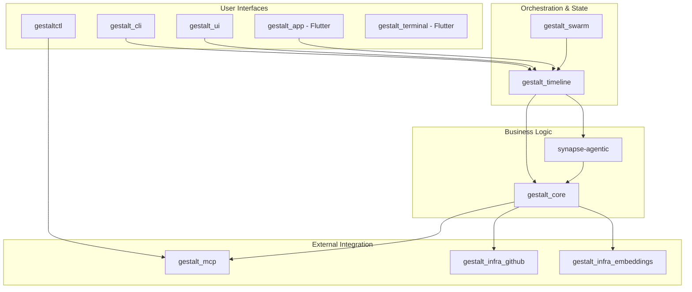
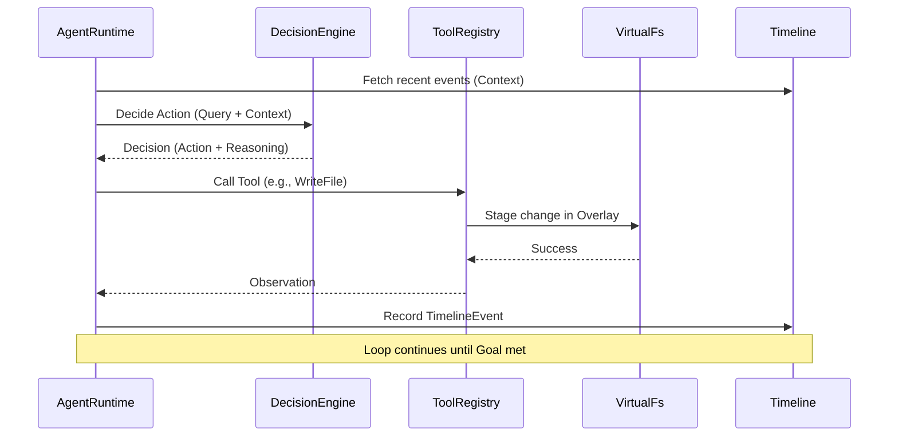
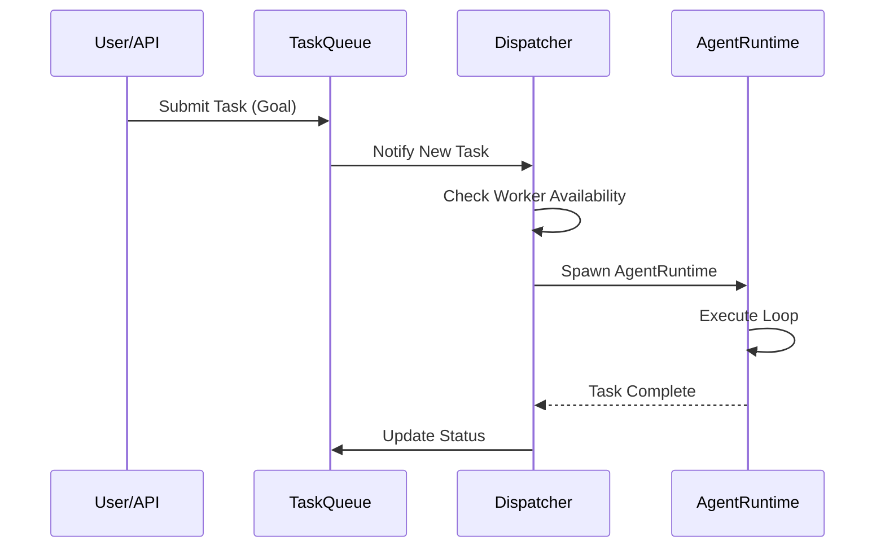

# Gestalt-Rust Architecture

> Last Updated: 2026-04-03
> Status: Comprehensive Documentation v1.0

## Overview

Gestalt-Rust is a high-performance **Rust workspace** implementing an autonomous AI agent runtime. It features timeline-based orchestration, a Virtual File System (VFS) overlay for isolated workspace manipulation, and a resilient multi-provider LLM infrastructure.

The system is designed to power multiple interfaces, from the low-latency Gestalt CLI to the Gestalt Nexus daemon and cross-platform Flutter applications.

---

## System Architecture

### Module Diagram

The ecosystem consists of 12 specialized modules:

---

## Module Specifications

### 1. `gestalt_core`
The "Hexagonal Core". Contains domain models, pure business logic, and port definitions.
- **Key Traits**: `McpClientPort`, `RepoManager`, `EmbeddingModel`, `VirtualFileSystem`.
- **Responsibility**: Validation, configuration parsing, and defining how the system interacts with the outside world without being tied to specific implementations.

### 2. `gestalt_timeline`
The primary orchestration engine.
- **Key Components**: `AgentRuntime`, `TimelineService`, `TaskQueue`, `VfsService`.
- **Responsibility**: Manages the "Source of Truth" (SurrealDB), handles the Think-Act-Observe loop, and manages isolated agent workspaces.

### 3. `synapse-agentic`
Actor-based agent framework.
- **Key Components**: `Hive` (actor system), `DecisionEngine`, `StochasticRotator`, `LLMProvider`.
- **Responsibility**: Provides LLM resilience, cost-tracking, and the underlying actor model for spawning autonomous sub-agents.

### 4. `gestalt_mcp`
Model Context Protocol implementation.
- **Function**: Implements both a server and client for MCP.
- **Tools**: Includes `analyze_project`, `search_code`, `exec_command`, and `git_status`.

### 5. `gestalt_cli`
The primary human interface.
- **Features**: Stateful REPL, task management commands, and "Swarm" mode for parallel execution.

### 6. `gestalt_swarm`
A high-throughput parallel execution bridge for CLI tasks.
- **Purpose**: Optimized for running many short-lived agent tasks (e.g., repository-wide refactoring) in parallel.

### 7. `gestalt_ui`
A native desktop management console built with `egui`.
- **Purpose**: Visualizing the universal timeline, agent status, and VFS diffs.

### 8. `gestaltctl`
A lightweight, standalone CLI tool for direct MCP server interaction and task tracking.

### 9. `gestalt_infra_github`
Infrastructure adapter for GitHub.
- **Interface**: Implements `RepoManager` using `octocrab`.

### 10. `gestalt_infra_embeddings`
Local ML infrastructure.
- **Interface**: Implements `EmbeddingModel` using BERT models via `candle`.

### 11. `gestalt_app` & 12. `gestalt_terminal`
Flutter-based applications for cross-platform (Mobile/Desktop) access to the Gestalt Nexus.

---

## Key Workflows

### Agent Autonomous Loop (Think-Act-Observe)

### Task Dispatching Workflow

---

## Error Handling Strategy

### 1. Propagation & Context
The system uses `anyhow::Result` for application-level error propagation, ensuring that failures carry backtraces and descriptive context (e.g., `.with_context(|| "failed to read config")`).

### 2. Domain-Specific Errors
Crates like `gestalt_core` use `thiserror` to define exhaustive error enums:
- `ConfigError`: Handles missing files, environment variable conflicts, and parsing failures.
- `VfsError`: Manages lock conflicts and path traversal attempts.

### 3. Failover & Resilience
- **LLM Failures**: `StochasticRotator` in `synapse-agentic` catches API timeouts/errors and automatically retries with the next available provider.
- **Silent Failures**: Critical services (like the Timeline fetch) are being moved from silent `Ok()` swallows to `warn!` logging or hard stops to prevent agents from operating with stale context.

---

## Security Considerations

### 1. VFS Isolation
Agents do not write directly to the host filesystem. Every agent operates within an `OverlayFs`. Changes are staged in memory and only flushed to disk after validation or human approval. Path traversal is prevented by strictly validating paths against the workspace root.

### 2. API Authentication
The `gestalt_timeline` server implements a fail-closed `auth_middleware`. Requests must provide a valid `GESTALT_API_TOKEN` via Bearer header or query parameter.

### 3. Tool Whitelisting
External command execution is restricted by a hard-coded whitelist (e.g., `git`, `cargo`, `gh`). Subprocesses are spawned with limited environment variables to prevent credential leakage.

### 4. Credential Management
API keys for LLM providers are loaded from environment variables or a secure `gestalt.toml`. Future iterations will integrate with OS keyrings (via the `keyring` crate) for OAuth token storage.

---

## Data Flow & State

- **Timeline**: Stored in **SurrealDB**. Every state change (task update, file edit, agent thought) is a `TimelineEvent`.
- **Files**: Managed by **FileManagerActor**. The VFS handles the mapping between physical disk and agent-specific overlays.
- **Configuration**: Managed by the `config` crate, merging `gestalt.toml`, environment variables, and CLI overrides.
