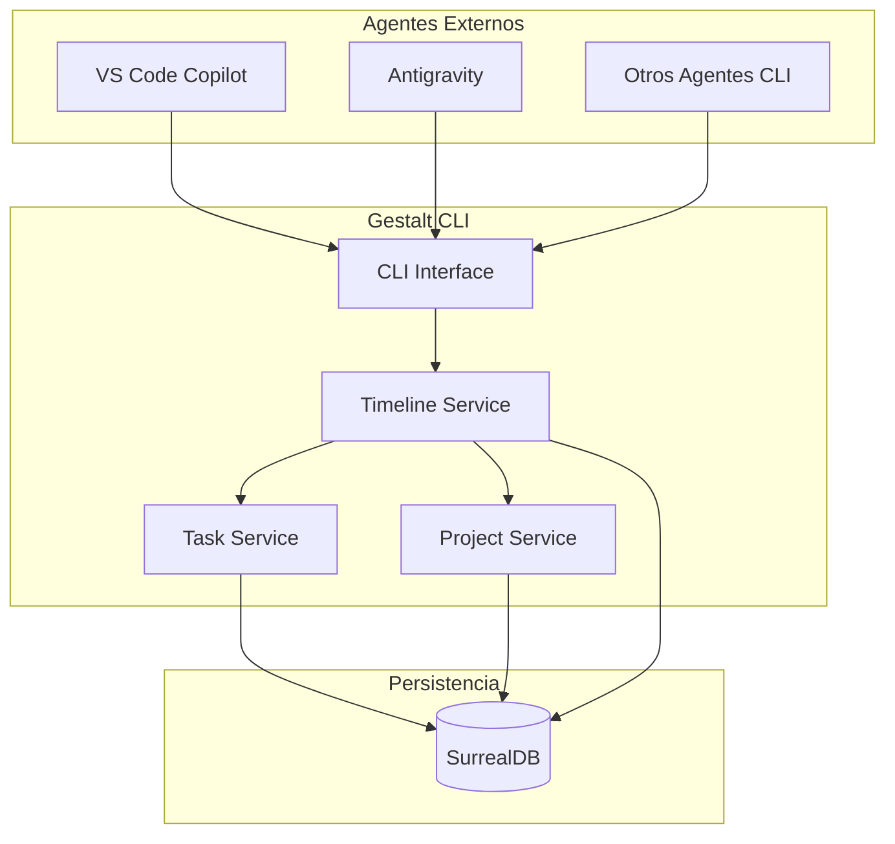
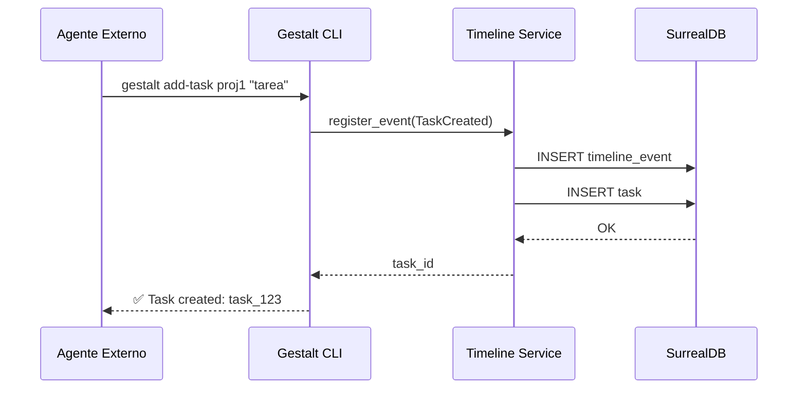

# 🧠 PLANNING.md - Gestalt Timeline Orchestrator

> **Meta-Agente Orquestador CLI con Línea de Tiempo Universal**

_Última actualización: 2025-12-19_

---

## 📋 Resumen del Proyecto

**Gestalt Timeline** es un sistema CLI diseñado para que múltiples agentes de IA (como VS Code Copilot, Antigravity, o cualquier sistema externo) puedan coordinar proyectos y subtareas en paralelo, utilizando una **línea de tiempo universal** como eje central de todas las operaciones.

### 🎯 Objetivo Principal
Crear un MVP funcional que permita a varios agentes coordinar proyectos y subtareas en paralelo, mostrando resultados en CLI y persistiendo estado en SurrealDB con **timestamp como variable primaria** en todas las operaciones.

---

## 🏗️ Arquitectura del Sistema



### Componentes Principales

| Componente | Descripción |
|------------|-------------|
| **Timeline Service** | Núcleo del sistema. Registra cada acción con timestamp UTC. Todos los agentes acceden a esta línea de tiempo en tiempo real. |
| **Task Service** | Gestiona subtareas, ejecución asincrónica y resultados. |
| **Project Service** | Maneja proyectos, estados y prioridades. |
| **CLI Interface** | Expone comandos para agentes externos. |
| **SurrealDB** | Persistencia de memoria, estado y línea de tiempo. |

---

## 🛠️ Stack Tecnológico

| Categoría | Tecnología | Justificación |
|-----------|------------|---------------|
| **Lenguaje** | Rust | Seguridad, rendimiento, concurrencia nativa |
| **Runtime Async** | `tokio` | Concurrencia de alto rendimiento |
| **Base de Datos** | SurrealDB | NoSQL multi-modelo, tiempo real, graph queries |
| **CLI Framework** | `clap` | CLI declarativo y robusto |
| **Serialización** | `serde` | JSON/CBOR nativo para SurrealDB |
| **Logging** | `tracing` | Observabilidad estructurada |

---

## 📦 Estructura del Proyecto

```
gestalt-rust/
├── gestalt_timeline/           # 🆕 Nuevo crate para el orquestador
│   ├── Cargo.toml
│   └── src/
│       ├── main.rs             # Entry point CLI
│       ├── lib.rs              # Core exports
│       ├── cli/
│       │   ├── mod.rs
│       │   └── commands.rs     # Definición de comandos
│       ├── services/
│       │   ├── mod.rs
│       │   ├── timeline.rs     # Timeline Service (núcleo)
│       │   ├── project.rs      # Project Service
│       │   └── task.rs         # Task Service
│       ├── models/
│       │   ├── mod.rs
│       │   ├── timeline_event.rs
│       │   ├── project.rs
│       │   └── task.rs
│       └── db/
│           ├── mod.rs
│           └── surreal.rs      # Cliente SurrealDB
├── gestalt_core/               # Existente
├── gestalt_cli/                # Existente
├── gestalt_app/                # Existente
├── PLANNING.md
├── TASK.md
├── CHANGELOG.md
├── README.md
└── .gitignore
```

---

## 🕐 Diseño de la Línea de Tiempo

### Concepto Central
El **timestamp** es la variable primaria de todo el sistema. Cada acción, comando, resultado o cambio de estado se registra en una línea de tiempo universal accesible por todos los agentes.

### Modelo de Datos: TimelineEvent

```rust
pub struct TimelineEvent {
    pub id: String,              // Unique ID (ULID preferido)
    pub timestamp: DateTime<Utc>, // ⭐ Variable primaria
    pub agent_id: String,         // Qué agente ejecutó la acción
    pub event_type: EventType,    // Tipo de evento
    pub project_id: Option<String>,
    pub task_id: Option<String>,
    pub payload: serde_json::Value,
    pub metadata: HashMap<String, String>,
}

pub enum EventType {
    ProjectCreated,
    ProjectUpdated,
    TaskCreated,
    TaskStarted,
    TaskCompleted,
    TaskFailed,
    AgentConnected,
    AgentDisconnected,
    CommandExecuted,
    Custom(String),
}
```

### Queries Temporales
SurrealDB permite queries sobre rangos de tiempo:
```sql
-- Eventos de las últimas 24 horas
SELECT * FROM timeline_events
WHERE timestamp > time::now() - 24h
ORDER BY timestamp DESC;

-- Timeline de un proyecto específico
SELECT * FROM timeline_events
WHERE project_id = $project_id
ORDER BY timestamp ASC;
```

---

## 🖥️ Especificación CLI

### Comandos Base

| Comando | Descripción | Ejemplo |
|---------|-------------|---------|
| `add-project <nombre>` | Registra nuevo proyecto | `gestalt add-project my-app` |
| `add-task <proyecto> <desc>` | Añade subtarea | `gestalt add-task my-app "Fix bugs"` |
| `run-task <task_id>` | Ejecuta tarea (async) | `gestalt run-task task_123` |
| `list-projects` | Lista proyectos | `gestalt list-projects` |
| `list-tasks [proyecto]` | Lista tareas | `gestalt list-tasks my-app` |
| `status <proyecto>` | Muestra progreso | `gestalt status my-app` |
| `timeline [--since=1h]` | Muestra línea de tiempo | `gestalt timeline --since=2h` |

### Comandos Avanzados (Fase 2)

| Comando | Descripción |
|---------|-------------|
| `watch` | Modo observador en tiempo real (proceso que no termina) |
| `broadcast <msg>` | Envía mensaje a todos los agentes conectados |
| `subscribe <proyecto>` | Suscribirse a eventos de un proyecto |

---

## 🔄 Flujo de Ejecución



---

## ⚙️ Consideraciones Técnicas

### Proceso Paralelo Persistente
Para el modo `watch` que no termina mientras esté en ejecución:
```rust
// Proceso que escucha eventos en tiempo real
#[tokio::main]
async fn run_watch_mode() {
    let mut stream = db.live::<TimelineEvent>("timeline_events").await?;
    while let Some(event) = stream.next().await {
        // Procesar y mostrar evento
        println!("{}: {}", event.timestamp, event.event_type);
    }
}
```

### Conexión de Agentes Externos
Agentes como VS Code Copilot pueden invocar comandos directamente:
```bash
# Desde cualquier terminal o script
gestalt add-task "my-project" "Implement feature X"
gestalt timeline --json  # Salida JSON para parsing
```

---

## 🚧 Restricciones y Decisiones

1. **No UI** - Solo CLI para máxima portabilidad entre agentes
2. **Rust puro** - Sin dependencias de Python o Node
3. **SurrealDB embebido o remoto** - Configurable vía env vars
4. **Timestamps UTC** - Siempre en UTC, conversión en cliente
5. **Salida JSON opcional** - Flag `--json` para integración programática

---

## 📝 Notas para Agentes de IA

- **Siempre leer `PLANNING.md`** al inicio de cualquier conversación
- **Consultar `TASK.md`** antes de comenzar cualquier trabajo
- **Registrar todas las acciones** en la línea de tiempo
- **Usar timestamps UTC** en todas las operaciones
- **Formato de comandos estricto** para parsing confiable
